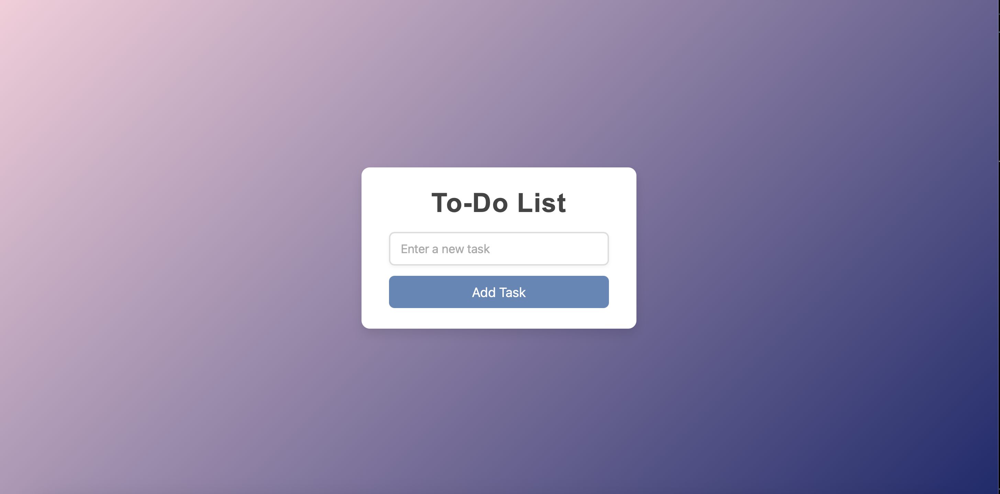

# To-Do List Web App

A simple, interactive To-Do List web application built with **HTML, CSS, and JavaScript**.  
Users can **add tasks, mark them as completed, and delete them** with a clean and responsive interface.

## Features

- Add new tasks
- Mark tasks as completed
- Delete tasks
- Responsive design for mobile and desktop
- Smooth animations for UI interactions

## Demo

Check out the live demo here: (https://to-do-list-sigma-seven-18.vercel.app)  


## Screenshots

  


## Technologies Used

- **HTML** – Structure of the app
- **CSS** – Styling and responsive design
- **JavaScript** – Dynamic task management

## How to Use

1. Clone the repository:
   ```bash
   git clone https://github.com/your-username/your-repo-name.git
Navigate to the project folder:
cd your-repo-name
Open index.html in your web browser.
Start adding, completing, and deleting tasks!
Folder Structure
/project-folder
   ├─ index.html
   ├─ style.css
   └─ script.js


